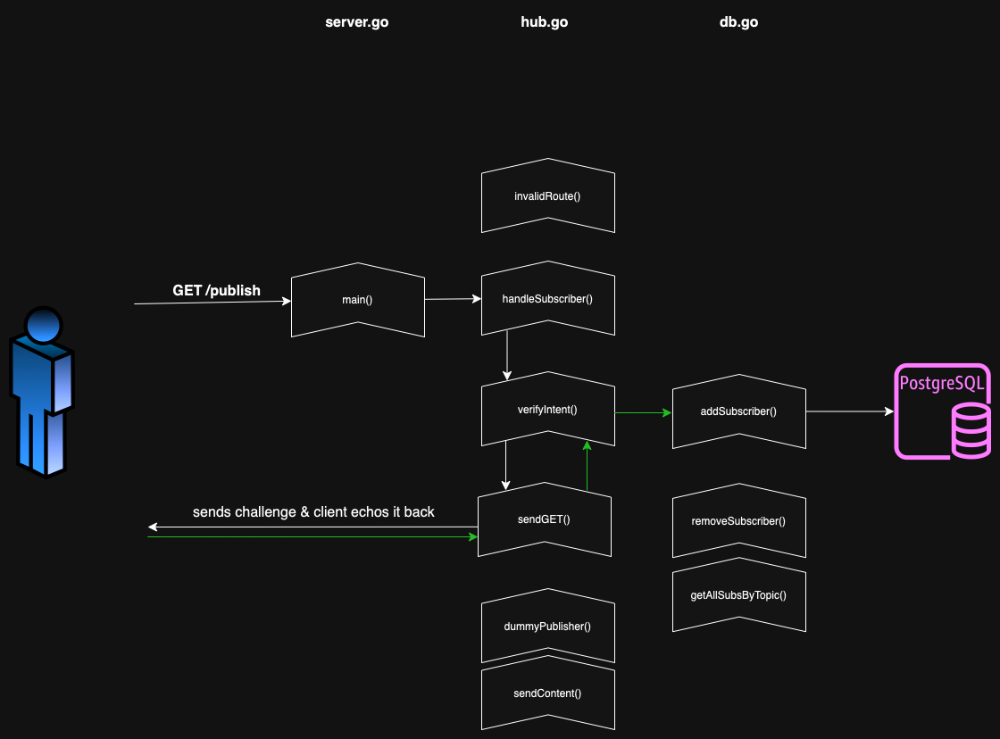
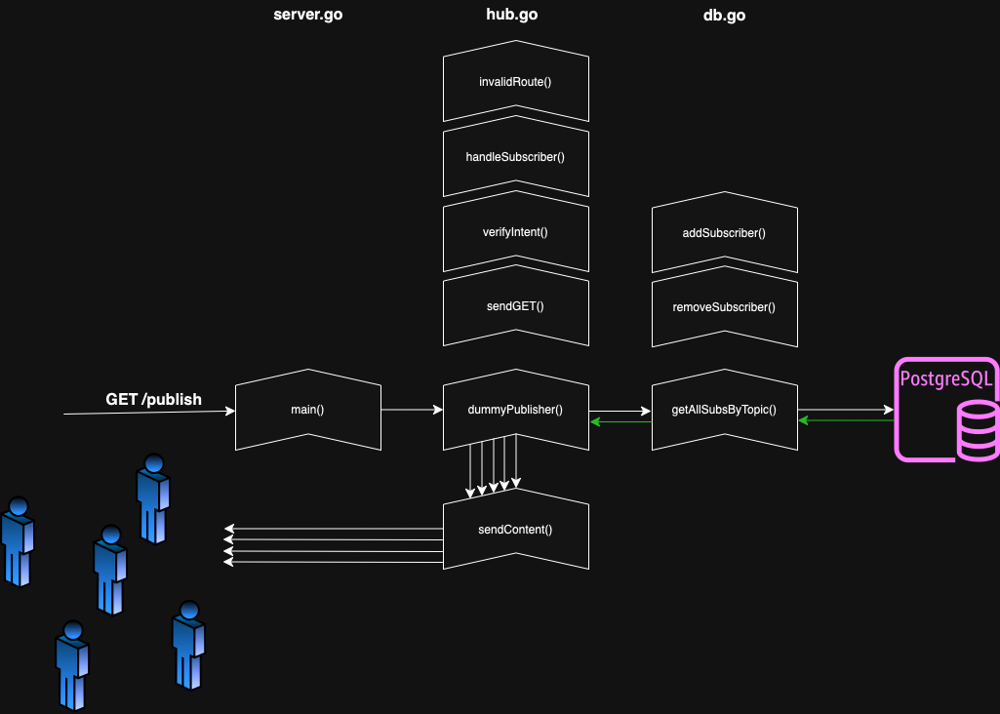

# WebSub Hub demo

Subhub is a small WebSub hub demo implemented in Go using echo, http/net, and Postgres. A live version of the hub is running [here](https://subhub.henriknorrman.com), listening for subscription to the topic "advice".

### WebSub
[WebSub](https://www.w3.org/TR/websub/) provides a common mechanism for communication between publishers of any kind of Web content and their subscribers, based on HTTP web hooks. Subscription requests are relayed through hubs, which validate and verify the request. Hubs then distribute new and updated content to subscribers when it becomes available. WebSub was previously known as PubSubHubbub.

### Features
  * Accepts all subscriptions with `hub.callback`, `hub.mode`, and `hub.topic` defined.
  * If provided, stores `hub.secret` for HMAC signature when broadcasting published content.
  * Does NOT implement a lease period on subscription requests.
  * Supports unsubscription requests.
  * Sends distributed content as JSON.
  * Sends `X-Hub-Signature` header with all content distributions.
  * Allows user to resubscribe to already subscribed topics.
  * Verifies every valid (required params are provided) subscription and unsubscription request.
  * Generates and broadcasts content to all subscribers of the `hub.topic` "advice".

### Endpoints

`POST /`: Reads header for required parameters and handle subscription requests. 

`GET /publish`: Acts as the publisher for testing, broadcasts content to subscribers.

### Files
**server.go** is the entry point to the server. It contains the `main()` function to the server where the port listener and routes are defined.

**hub.go** holds all WebSub Hub logic, and most of the code. The Hub is not concerned with how or where the subscriber data is stored, as long as the following functions are defined:
* `type hubStore struct {}`
* `(h *hubStore) init()`
* `(h *hubStore) addSubscriber(callback string, secret string, topic string, timestamp int64)`
* `(h *hubStore) removeSubscriber(callback string, topic string)`
* `(h *hubStore) getAllSubsByTopic(topic string) []subscription`


**db.go** holds all Postgres logic: connecting to the database, creating tables, and making queries. All SQL and database code is contained within this file. 


### Flow
The following diagrams shows the main action flow through the hub, from client to database. The three columns represent the different code files and how they interract.

#### Sucessful subscription requests
The diagram shows a successful subscription `POST` request to `/`. The request is first passed to `handleSubscriber()` where parameters are checked and read. If the requests contains everything to be verified, the information is then passed to `verifyIntent()` for verification. This function in turn uses `sendGET()` to send off the `GET` request. If everything is successful, `verifyIntent()` then calls `addSubscriber()` which sends `INSERT` query to the database.

<div align="center">

</div>


#### Successful publish requests
The diagram shows a successful `/publish` call. The `dummyPublisher()` fetches all subscriber data from the database using `getAllSubsByTopic()`. For every stored subscription, `sendContent()` is called in parallel to broadcast the content to all relevant subscribers.

<div align="center">

</div>


### Demo
#### Requirements
* Docker
  
#### Run demo

The local demo uses `modfin/websub-client:latest` as a Subscriber and runs entirely in Docker containers. To run the demo:

```
docker compose up --build
```

The Subscriber will automatically subscribe to the Hub. To resubscribe send a GET request to (or open in a browser):

```
http://localhost:8080/resub
```

To distribute content from the Hub to the Subscribers.

```
http://localhost/publish
```

To view the successfully recieved content on the Subscriber:

```
http://localhost:8080/log
```


#### Live version
A live version of the hub (without the subscriber container) is running on https://subhub.henriknorrman.com.


